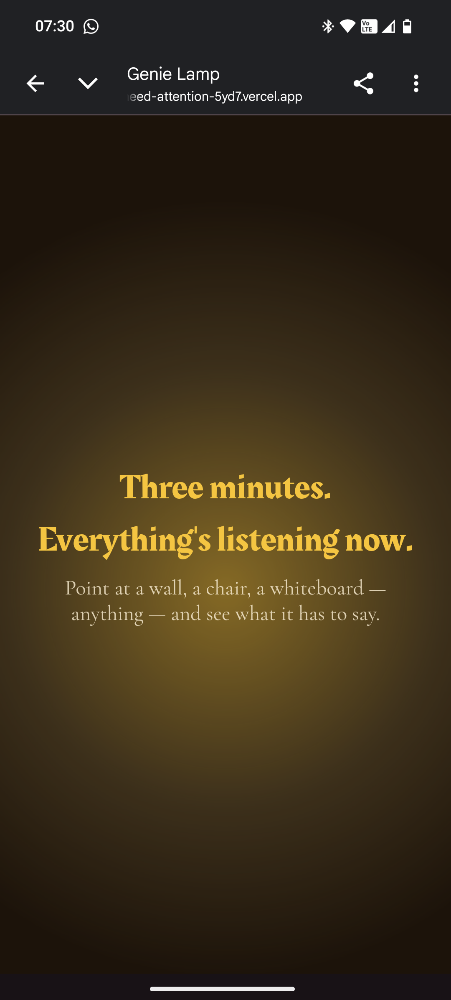
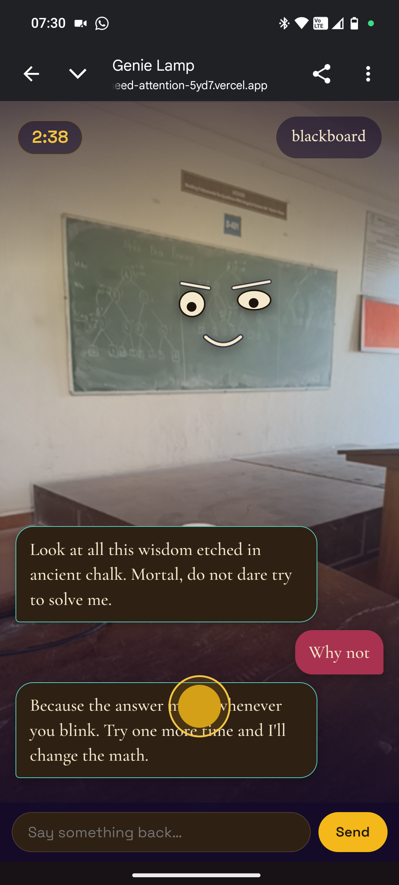
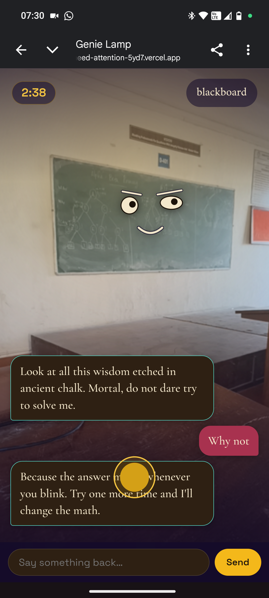
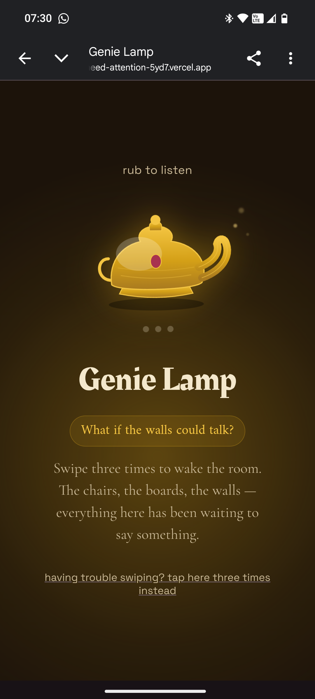

# Genie Lamp 🧞

## Basic Details

<<<<<<< HEAD
### Team Name: ASWATHI THUMMARUKUDY

### Team Members
- Team Lead: ASWATHI THUMMARUKUDY - VISWAJYOTHI COLLEGE OF ENGINEERING AND TECHNOLOGY
=======
### Team Name: Aswathi Thummarukudy

### Team Members
- Team Lead: Aswathi Thummarukudy - Viswajyothi College of Engineering and Technology
>>>>>>> f93578052e3490c61cc63b743563aebe0d850995

### Project Description
Point your phone's camera at any object — a bench, a fan, a wall — and it wakes up with a personality, talks back to you, and won't stop until your three minutes of "genie powers" run out.

### The Problem (that doesn't exist)
Every day, people walk past benches, desks, walls, and fans without once stopping to ask what those objects think of them. This is a crisis of unheard furniture opinions.

### The Solution (that nobody asked for)
Rub a lamp. Get three minutes of "genie powers." Point your phone at literally any object in the room and it identifies itself, adopts a wildly inappropriate personality, talks to you out loud with an animated blinking face, and holds a grudge for exactly 180 seconds before ghosting you forever.

## Technical Details

### Technologies/Components Used
For Software:
- **Languages:** JavaScript, HTML, CSS
- **Frameworks:** None (vanilla JS, single-page app)
- **Libraries/APIs:** Groq API (`qwen/qwen3.6-27b`, vision-capable) for object identification + in-character dialogue, Web Speech API (`speechSynthesis`) for text-to-speech, custom hand-built SVG "eye rig" for animated blinking/talking eyes
- **Tools:** Vercel (hosting + serverless functions for the API proxy), Git/GitHub

### Run
https://i-need-attention-5yd7.vercel.app/

## Project Documentation

### Screenshots
<p align="center">
  
</p>
 
<p align="center">
  
  
</p>
<p align="center">
  
</p>
### Diagrams
```
[Browser: Camera + UI]
      |
      | captures frame as base64 image
      v
[Vercel Serverless Function: /api/gemini.js]
      |
      | forwards image + personality prompt + conversation history
      v
[Groq API — qwen/qwen3.6-27b]
      |
      | returns: object label + in-character text + eye position
      v
[Back to Browser]
      |
      +--> Chat bubble (personality-accent-colored)
      +--> speechSynthesis.speak(text)
      +--> Animated eye rig overlay on the object
```
## Project Demo

## Team Contributions
<<<<<<< HEAD
- [Your Name]: Full-stack build — frontend UI/UX, camera capture, Groq API integration, personality system, timer/unlock logic, text-to-speech, custom animated eye rig.
=======
- [Your Name]: Full-stack build — frontend UI/UX, camera capture, Groq API integration, personality system, timer/unlock logic, text-to-speech, custom animated eye rig.
>>>>>>> f93578052e3490c61cc63b743563aebe0d850995

